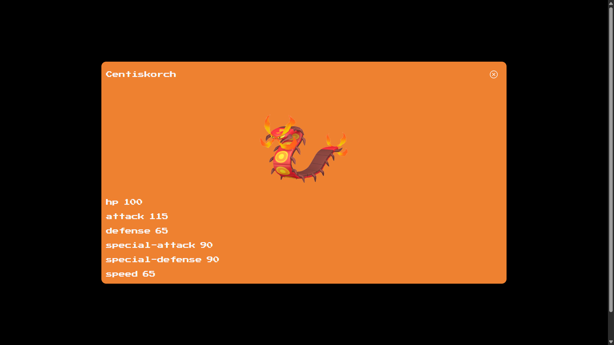

# Pokemondex

Ho sviluppato un pokedex completo, dove si possono sfogliare i pokemon e vederne i dettagli, in aggiunta con una schermata in cui si può cercare rapidamente il pokemon di cui leggerne le informazioni. Il progetto è stato suddiviso in queste fasi: 
- realizzazione della landing page, con i pokemon posti su griglia, con la card che assume il colore di sfondo in base al tipo del pokemon, in fondo è presente una paginazione per organizzare meglio il contenuto
- implementazione della barra di navigazione, per fare capire all'utente su quale schermata si sta trovando, esclusi il modale delle stats e la pagina di dettaglio del pokemon
- implementazione del form per cercare il pokemon, una volta che si preme sul pulsante search il contenuto testuale del box di ricerca si resetterà e verrà mostrata la card del pokemon cercato che comparirà sotto al form di ricerca
- realizzazione della vista responsive per i telefoni e i tablet

# Tecnologie utilizzate:
- ReactJS
- Javascript
- Tailwind
- Tailwind Flowbite
- Axios
- PokéAPI

# Ecco alcune immagini:

